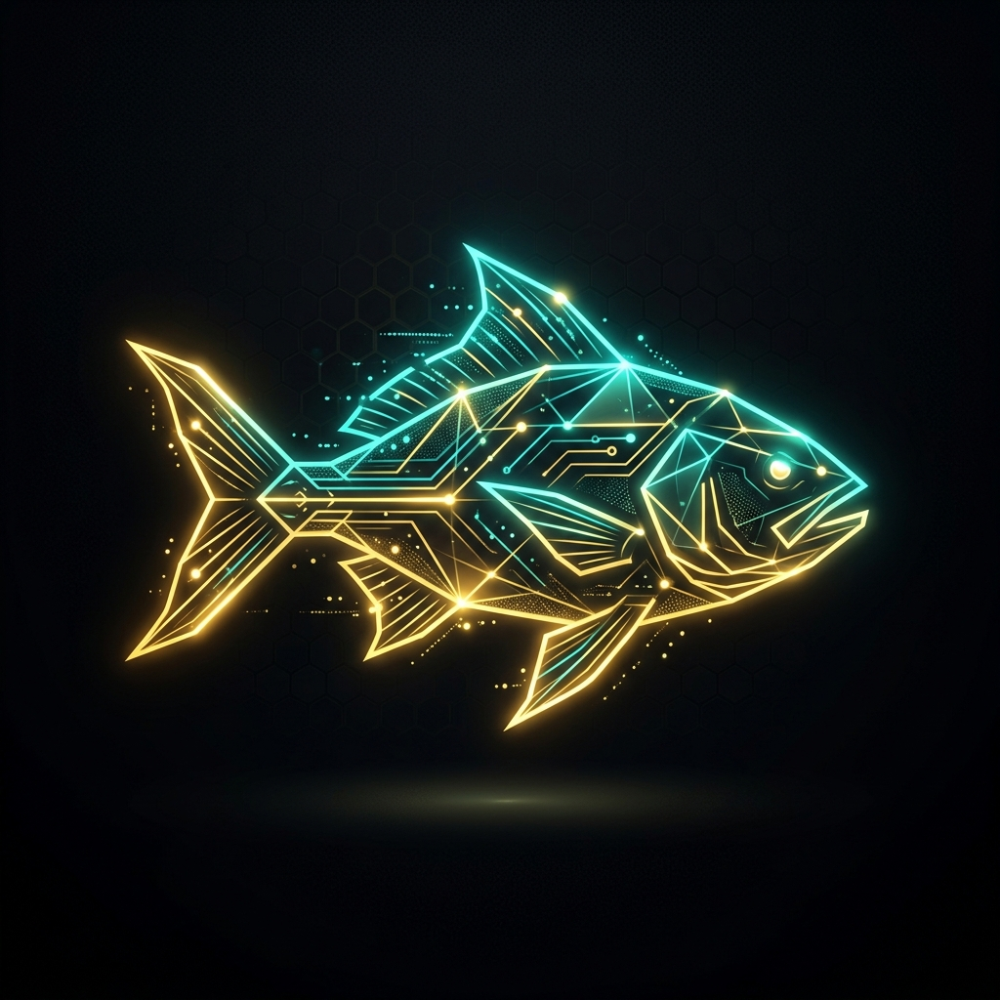

#  BigFish — Autonomous Betting Predictive AI

**BigFish** is a fully autonomous, premium sports betting predictive terminal. It leverages a multi-agent AI architecture to continuously fetch live global football data, execute mathematical Poisson distributions, parse news sentiment, and calculate Expected Value (+EV) to find profitable edges against global sportsbooks.

**🌐 Live Demo:** [https://JesunAhmadUshno.github.io/BigFish](https://JesunAhmadUshno.github.io/BigFish)

---

## ⚡ Core Autonomous Agents

### 1. 🧠 Dixon-Coles Predictive Engine
The core mathematical backbone of BigFish. This agent calculates Expected Goals (xG) by modeling the attack strength and defense vulnerability of every team based on historical Elo ratings. It applies a Poisson distribution to predict exact scorelines, factoring in the low-scoring nature of football ($\rho$ correlation).

### 2. 📰 NLP Sentiment Agent
An autonomous natural language processing agent that continuously scans for external variables. It analyzes weather (WBGT), extreme altitude changes, team morale, and critical player injuries, adjusting the mathematical xG output with an Environmental Multiplier.

### 3. 💰 Kelly Criterion Risk Manager
The financial brain of BigFish. It continuously monitors the live bookmaker odds and compares them against the AI's true probabilities to find Expected Value (+EV). It strictly dictates stake sizing using Fractional Kelly formulas to maximize bankroll growth while minimizing the risk of ruin.

### 4. ⏱️ Live Monte Carlo Simulator
Runs real-time simulations during active matches. By consuming live match time and current scores, this agent recalculates the remaining Expected Goals using linear time-decay, updating the win probabilities second-by-second.

---

## 🌍 Global API Integrations

BigFish operates 100% autonomously by continuously polling data from the global internet without requiring a backend server. 

- **[WorldCup26.ir](https://worldcup26.ir/)**: Fetches the official, free 2026 FIFA World Cup schedules, group standings, stadiums, and live match scores.
- **[The Odds API](https://the-odds-api.com/)**: Connects to global sportsbooks to pull real-time, live betting markets for Expected Value (+EV) comparison.

---

## 🚀 Deployment (GitHub Pages)

BigFish is designed to be hosted 100% free and autonomously on **GitHub Pages**. The repository includes a GitHub Action workflow that automatically builds the Next.js static export and pushes it to the internet whenever you push code.

### Local Development
\`\`\`bash
# Install dependencies
npm install

# Add your Odds API Key
echo "ODDS_API_KEY=your_key_here" > .env.local

# Start the dev server
npm run dev
\`\`\`

---

## 🤝 Contributing
Built by Jesun & Ushno. Pull requests are welcome for algorithm optimizations or new UI dashboard features.

**License:** MIT
