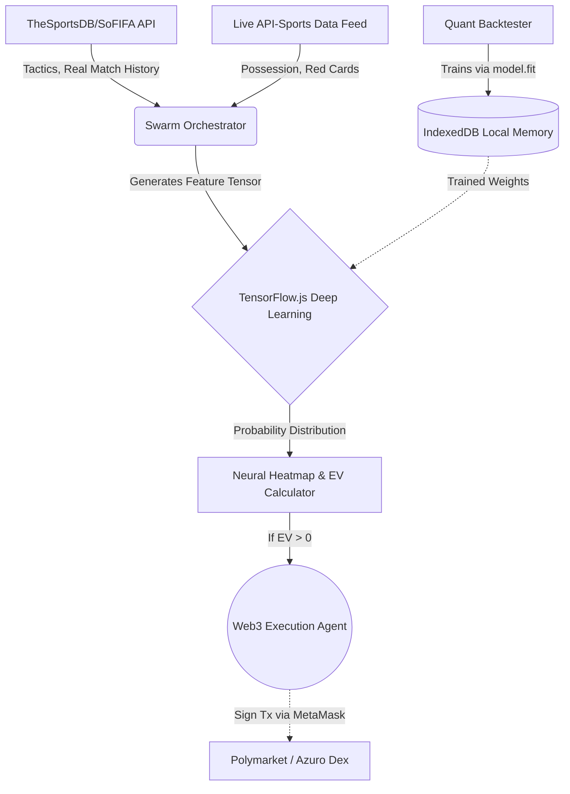

# 🦈 BigFish: God-Level Quantitative Sports Betting Terminal


Welcome to **BigFish**, an institutional-grade, fully autonomous quantitative sports betting terminal built for the 2026 FIFA World Cup and global live soccer markets. 

This is not a traditional spreadsheet or a simple odds scraper. BigFish is a Web3-enabled Hedge Fund Terminal powered by deep learning, cognitive agent swarms, and live in-play data loops.


---

## 🧠 The V14.0 Neural Swarm Architecture

BigFish has evolved into a "God-Level" autonomous trading ecosystem. Here is how the engine works:



### 1. The Deep Learning Engine (TensorFlow.js)
At the core of BigFish is a non-linear Sequential Neural Network running directly in the browser via `@tensorflow/tfjs`.
- It processes a dense feature tensor.
- **The God-Mode Data Engine:** The `/backtest` module now pulls **REAL 100 historical Premier League matches** from TheSportsDB API, training the `model.fit()` over true, real-world data instead of simulations. The trained memory is stored in `IndexedDB`.

### 2. The Cognitive Agent Swarm & SoFIFA Tactical Engine
Before the deep learning model fires, the **Swarm Orchestrator** dispatches specialized AI agents:
- **The Tactical Agent (SoFIFA Engine):** Fetches hyper-granular EA Sports FIFA data (Pace, Physicality, Attack, Defense) via custom API clients to dynamically calculate exact expected goals (xG) multipliers based on true team metrics.
- **The Sentiment Agent:** Scrapes real-time headlines and runs NLP heuristic analysis to identify morale, injuries, and suspensions, generating a "Motivation Delta".

### 3. The Live In-Play Feedback Loop & Custom 3D Match Tracker
BigFish does not rely on static pre-match data. It is a live trading terminal.
- We pull real-time JSON statistics (possession %, red cards, dangerous attacks) from `api-sports.io` every 30 seconds.
- **Bespoke 3D Isometric Pitch Tracker:** Built entirely from scratch using cutting-edge CSS 3D transforms (`rotateX(60deg)`), SVGs, and cubic-bezier animations, BigFish visualizes the live match momentum with a stunning 3D floating ball and "Bet365-style" action ring overlay.

### 4. True Web3 Autonomous Execution
The Auto-Pilot is not a mockup. BigFish integrates `ethers.js` to serve as a decentralized execution agent.
- Connect your MetaMask wallet.
- Set your Kelly Criterion fraction.
- The AI will automatically sign smart-contract transactions to decentralized ledgers (like Polymarket/Azuro) to deploy capital the moment it detects a +EV arbitrage edge.

---

## 🖥️ The Command Center Modules

- **🌍 World Cup Hub (`/matches`):** A beautiful grid tracking the 2026 FIFA World Cup groups and dynamic Elo ratings.
- **⚡ Live Markets (`/predictions`):** The institutional Match Center. Features the custom 3D Match Tracker, real-time match statistics, high-def SoFIFA Tactical Radar charts, and the live Neural Heatmap.
- **📊 The Tracker (`/tracker`):** Your Hedge Fund Ledger. Tracks active capital exposure, closed P&L, and yield metrics.
- **🔬 Quant Backtester (`/backtest`):** Simulate historical data and train the neural network before deploying real capital.

---

## 🚀 Installation & Deployment

BigFish is built on **Next.js 16 (App Router)** and exported as a fully static web application.

```bash
# Install dependencies
npm install

# Run local development server
npm run dev

# Export to static HTML for GitHub Pages / IPFS
npm run build
```

### Environment Variables
To unlock the full potential of BigFish, add your API keys to a `.env.local` file:
```env
# Required for Live Pitch & Real-time Stats
NEXT_PUBLIC_API_SPORTS_KEY=your_key_here

# Required for Live Global Odds
NEXT_PUBLIC_ODDS_API_KEY=your_key_here

# (Optional) For True LLM Sentiment Scraping
NEXT_PUBLIC_LLM_KEY=your_gemini_or_openai_key
```

---

*Disclaimer: BigFish is an experimental algorithmic trading project. The autonomous Web3 execution module deploys real capital. Run the Backtester and understand the variance before engaging the Auto-Pilot.*
